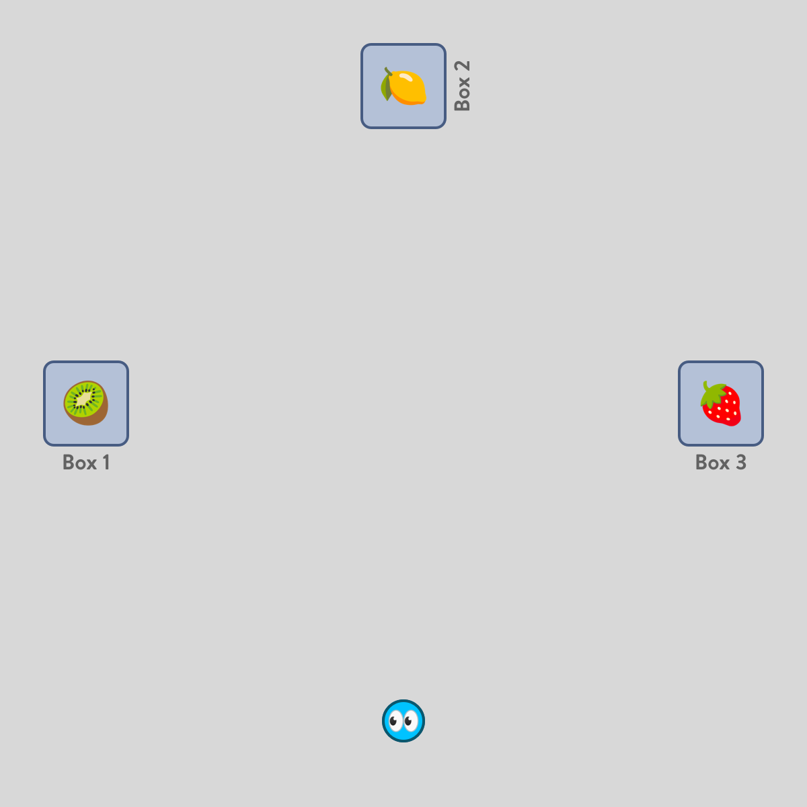
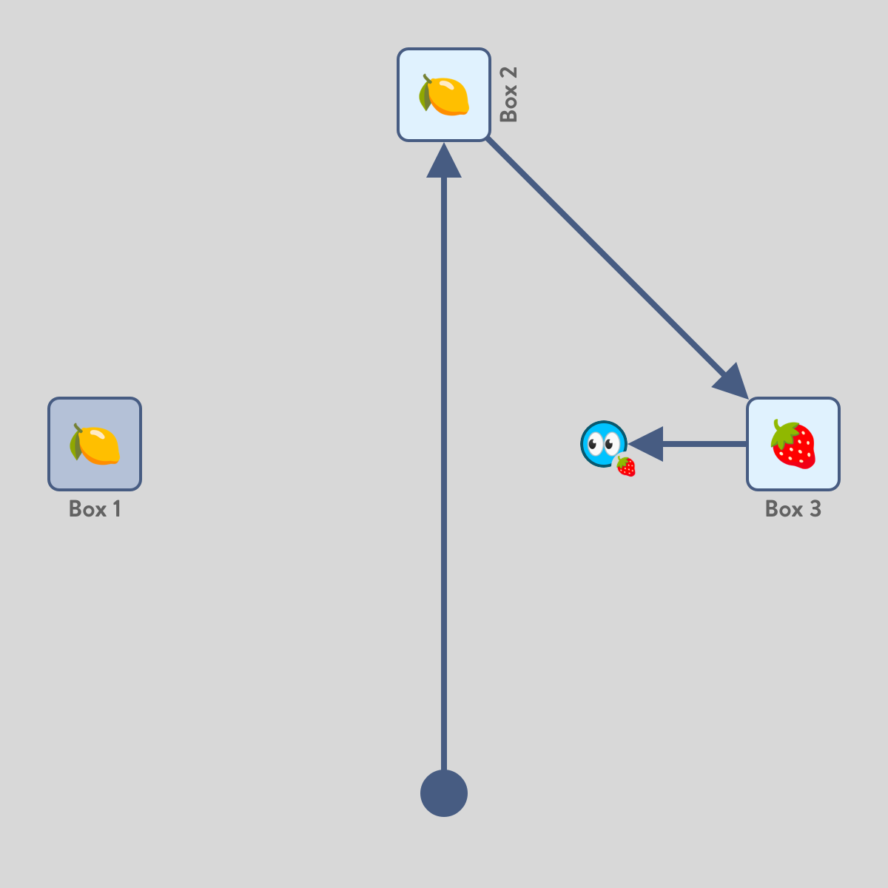

# BoxesWorld

A scalable MOMDP that mirrors a box-searching task for an item.

- Action space: `[[Move(box) for box in 1:num_boxes]..., Take()]`
  - `Move(box)` will move the agent from its current location to the targeted `box`.
  - `Take()` will take the contents at the current box. At the spawn location, this is
    an invalid action which does not transition to a new state.
- Observation space: `[item for item in ITEMS]`
  - `item` only has the requirement that it's a `Symbol`. Thus, the agent may observe
    whatever items you specify are allowed to be in the boxes.
    **Note** that `BoxesWorld` does not support items only being in certain boxes (e.g.,
    lemons (🍋) are only allowed in odd-number boxes).
- State space: `[State(box_location, [item for item in ITEMS]) for box_location in BOX_LOCATIONS]`
  - You must provide locations for each of the boxes, these will be used to compute
    a state-space, which is where we achieve **Marginal** observability. The agent
    _always_ knows their location, but beliefs take shape over the contents of the
    boxes.

## Example (3 boxes, 4 fruits: [🍋, 🍓, 🥝, 🍍])

<small>Example code in `examples/boxes=3-fruits=🍋🍓🥝🍍`</small>

The world is rotated by 45 degrees to accentuate costs, but is set in a 5x5 grid-like
world. Specifically, there are 3 boxes at `(1, 5)`, `(5, 5)`, and `(5, 1)`. Each box
may contain only one fruit, but collectively there may be any combination of fruits.

  
  

On the left, we have an agent in a 3-box world with a kiwi (🥝), lemon (🍋), and
strawberry (🍓) in boxes 1, 2, and 3, respectively. The agent cannot observe the
contents of the box until it visits the box.

On the right, we have an agent in a similar world but with lemons (🍋) in boxes 1
and 2, and a kiwi (🥝) in box 3. The agent took actions `Move(2), Move(3), Take()`.
Thus, the agent took the strawberry (🍓) in Box 3.